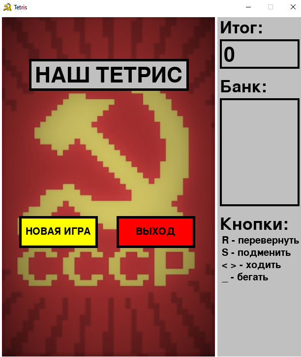
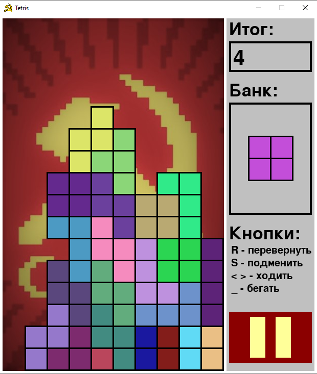
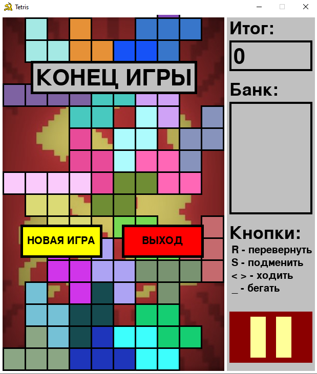

# Russian_Tetris
### Motivation:
https://www.youtube.com/watch?v=umEDct4BoGc

https://www.youtube.com/watch?v=9Fv5cuYZFC0

### Usage:
Run play.py with all other files in the same project

### Frames from game:
Menu:

Gameplay:

Game Over:

